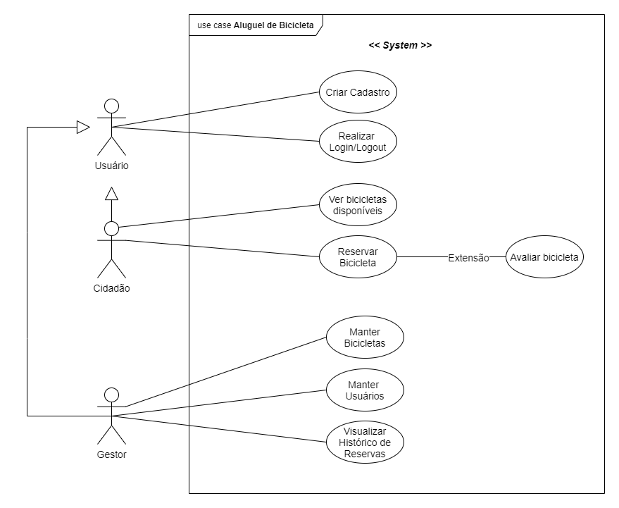
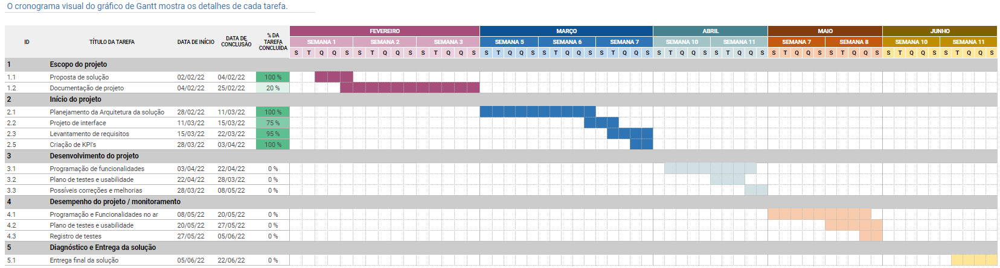
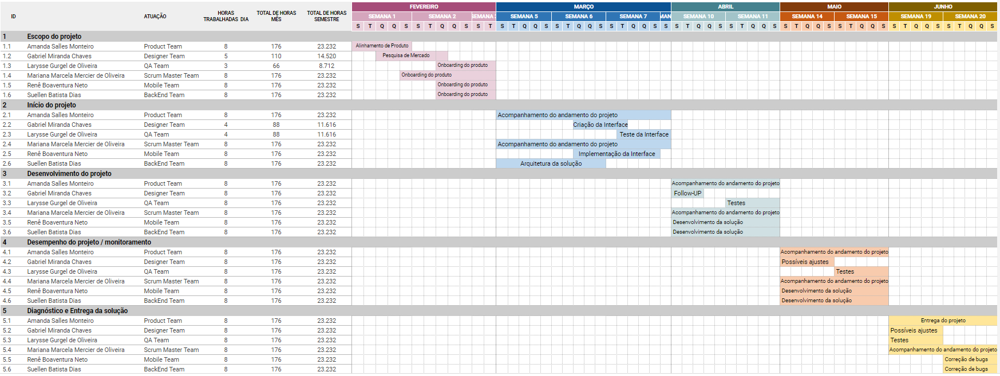
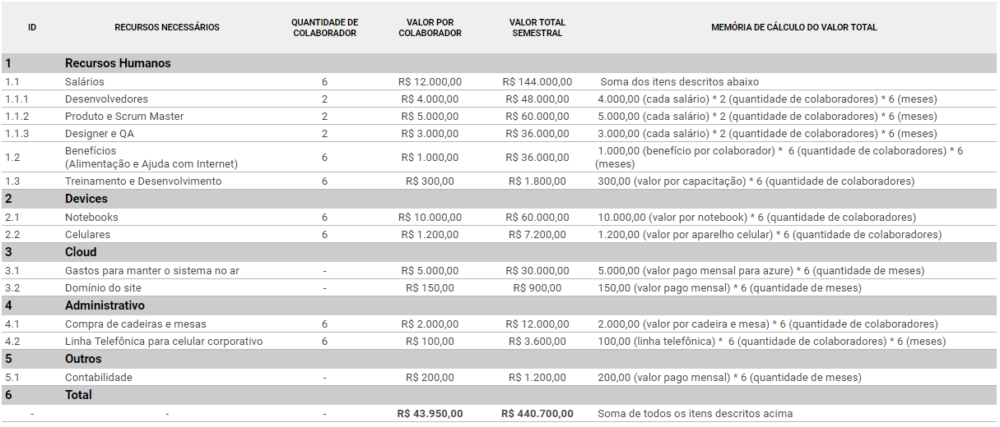

# Especificações do Projeto

Pré-requisitos: <a href="1-Documentação de Contexto.md"> Documentação de Contexto</a>

A definição do problema bem como a ideia de solução abordados neste projeto foram solidificadas através da criação de evidências empíricas do contexto de desigualdade social do nosso país, ampliada pela pandemia de COVID-19, amparadas por pesquisa realizada pelos membros da equipe tendo como fonte os principais portais de notícias do país.

As particularidades verificadas neste processo serão apresentadas na forma de personas, histórias de usuários, definição de requisitos funcionais e não funcionais além das restrições do projeto.

## Personas

Nos quadros abaixo são apresentadas as personas definidas durante o processo de entendimento do problema.

|   | **João Mendes**   48 anos   |
|:---------------------------------------:|:-------------------------------:|
|**Ocupação** |  Publicitário   Tem ensino superior em comunicação|
|**Motivação** | Quer ter uma vida mais saudável e usar menos seu carro
|**Dispositivos** |Possui um samsung de última geração |
|**Aplicativos** |Facebook App do G1|

  

|  | **Anita Camões**   40 anos   |
|:---------------------------------------:|:-------------------------------:|
|**Ocupação** | Gestora do serviço de bicicletas|
|**Dispositivos** |Tem um Motorola de 2020 |
|**Aplicativos** |Whatsapp Facebook|

  

|   | **Camila Themes**   35 anos   |
|:---------------------------------------:|:-------------------------------:|
|**Ocupação**|   Advogada |
|**Motivação** |   Trabalha de casa e está esperando chegarmos em um alto nível de imunização com as vacinas antes de voltar a vida normal.  Assiste a muitas notícias e sente um dever de contribuir, visto que sua situação financeira não foi afetada na pandemia|
|**Dispositivos** |Tem um iphone de última geração |
|**Aplicativos** |Facebook|

  

|   | **Otávio Cardoso**   20 anos   |
|:---------------------------------------:|:-------------------------------:|
|**Ocupação**|   Estudante |
|**Motivação** |    Frequentar parques e museus no centro de São Paulo |
|**Dispositivos** |Tem um android de segunda mão |
|**Aplicativos** |instagram, twitter e tik tok|

  

|   | **Fred Silva**   33 anos   |
|:---------------------------------------:|:-------------------------------:|
|**Ocupação**|   Desempregado |
|**Motivação** |   Deseja gastar pouco para conseguir se locomover para entrevistas de emprego|
|**Dispositivos** |Tem um Xiaomi de 2019 |
|**Aplicativos** |instagram, telegram|

  

|   | **Jéssica Prates**   28 anos   |
|:---------------------------------------:|:-------------------------------:|
|**Ocupação**|   Professora de ginástica |
|**Motivação** |   Tem medo de pegar transportes públicos devido a covid, mas não possui carro|
|**Dispositivos** |Tem um iphone de última geração |
|**Aplicativos** |instagram, whatsapp, tik tok|

  

## Histórias de Usuários

Com base na análise das personas foram identificadas as seguintes histórias de usuários:

|EU COMO... `PERSONA`| QUERO/PRECISO ... `FUNCIONALIDADE` |PARA ... `MOTIVO/VALOR`                 |
|--------------------|------------------------------------|----------------------------------------|
|Usuário  | criar um cadastro como usuário  | acessar a plataforma              |
|Usuário  | ver bicicletas disponíveis para datas específicas   | reservar uma bicicleta             |
|Usuário  | filtrar a bicicleta por cor, modelo, avaliação e local   | escolher a melhor bicicleta            |
|Usuário  | Reservar uma bicicleta   | usar a bicicleta na data marcada              |
|Gestor  | criar, visualizar, editar e deletar bicicletas   | manter controle do inventário             |
|Gestor  | criar, visualizar, editar e deletar usuários   | manter controle do acesso às bicicletas             |
|Gestor  | criar, visualizar, editar e deletar gestores   | manter controle do acesso ao sistema             |
|Gestor  | ver todos os usuários que reservaram uma bike   | encontrar responsáveis por danos a bicicleta             |
| Gestor | ver todas as bicicletas que foram reservadas e por quais períodos   | acompanhar necessidade de manutenção            |

  

## Modelagem do Processo de Negócio 

### Análise da Situação Atual

Não existe no mercado uma proposta de negócio que permita que uma pessoa física disponibilize sua bicicleta para aluguel. Atualmente, uma pessoa que deseje pagar pelo uso temporário de uma bike, precisa recorrer a serviços oferecidos através de parcerias entre entidades comerciais e órgãos estatais (Itaú, Estado de São Paulo). Tais serviços são limitados a áreas reduzidas, acessíveis a um público pequeno, e priorizam o uso para o lazer. 

### Descrição Geral da Proposta

Nossa proposta adiciona a figura do parceiro, que é uma pessoa física que busca disponibiliza sua bike quando esta não está sendo utilizada. Para comparar o processo _as is_ e o processo _to be_, utilizamos como exemplo o serviço de aluguel de bikes oferecido pelo Itaú. De forma sucinta, modelamos o fluxo do processo nas duas opções.  

### Processo Atual – ALUGUEL DE BICICLETAS DO ITAÜ

Neste modelo, a interação se dá entre o Itaú e o usuário, mediada pelo aplicativo.

### Processo Proposto – NOSSA BIKE

Nossa proposta agrega uma terceira entidade principal ao processo, que fornece a bike. 

## Indicadores de Desempenho

| # | Indicador | Objetivos | Descrição | Cálculo | Fonte | Perspectiva|  
|---|-----------|-----------|-----------|---------|-------|------------|
| 1 | Downloads | Acompanhar o crescimento do aplicativo | Avaliar a taxa de downloads realizados na loja| nº de downloads / período | Playstore | Crescimento e Aprendizado |
| 2 | Usuários Cadastrados | Mensurar a quantidade de cadastros efetuados no aplicativo | Avaliar a taxa de cadastros realizados no aplicativo após o download | nº de cadastros / período | Banco de Dados| Crescimento e Aprendizado |
| 3 | Engajamento | Avaliar o sucesso do aplicativo | O engajamento medirá o tempo em que as pessoas permanecem utilizando o aplicativo e quantas vezes ele é aberto | Realizado pela ferramenta Google Mobile App Analytics | Google Mobile App Analytics | Crescimento e Aprendizado |
| 4 | Conversão | Mensurar a quantidade de locações efetivas | Avaliar a taxa de locações realizadas via aplicativo | nº de locações / período | Playstore | Clientes | 
| 5 | Desinstalação | Compreender as razões que levaram à desinstalação | Avaliar o que pode ser mudado para prevenir outras desinstalações do aplicativo | nº de desinstalações / período | Playstore | Processos Internos | 

## Requisitos

As tabelas que se seguem apresentam os requisitos funcionais e não funcionais que detalham o escopo do projeto.

 

### Requisitos Funcionais

|ID    | Descrição do Requisito  | Prioridade |
|------|-----------------------------------------|---------|
|RF-001​​ | Permitir que o usuário crie cadastro​ | ALTA​​ |
|RF-002 | Permitir que o usuário/gestor efetue login​​ | ALTA​​ |
|RF-003​​ | Permitir que o usuário/gestor efetue logout​​ | ALTA​​ |
|RF-004​​ | Permitir que o usuário visualize uma lista das localidades​​ | ALTA |​​
|RF-005​​ | Permitir que o usuário filtre a lista de bikes​​ | ALTA​​ |
|RF-006 | Permitir que o usuário reserve uma bike | ALTA |​​
|RF-007 | Permitir que o usuário veja suas reservas​​ | ALTA |
|RF-008 | Permitir que o usuário cancele sua reserva | ALTA |
|RF-009​​ | Permitir que o usuário avalie uma bike | MÉDIA |​
|RF-010 | Permitir que o gestor crie uma bike | ALTA |​
|RF-011 | Permitir que o gestor edite uma bike | ALTA |​
|RF-012 | Permitir que o gestor delete uma bike | ALTA |​
|RF-013 | Permitir que um gestor crie cadastro para outro gestor ou usuário​ | ALTA​​ |
|RF-014 | Permitir que o gestor edite um usuário | ALTA |​
|RF-015 | Permitir que o gestor delete um usuário | ALTA |​
|RF-016​​ | Permitir que o gestor veja uma lista de usuários | ALTA |
|RF-017 | Permitir que o gestor veja uma lista de bicicletas​ | ALTA |​

 

### Requisitos não Funcionais

|ID     | Descrição do Requisito  |Prioridade |
|-------|-------------------------|-----------|
|RNF-001| O sistema deve focado para o uso em mobile (mobile-first) | ALTO | 
|RNF-002| O sistema deve funcionar nos principais stemas operacionais mobile de forma nativa | ALTO | 
|RNF-003| Deve seguir os padrões de acessibilidade |  MÉDIO | 
|RNF-004| O formulário tem que ser de fácil preenchimento permitindo autocompletar| MÉDIO | 
|RNF-005| As requisições devem ser leves para funcionar bem em áreas mais remotas | BAIXO | 
|RNF-006| Deve exigir o mínimo de RAM possível para funcionar em aparelhos bem simples |  BAIXO | 
|RNF-007| O sistema deve ser implementado na linguagem C# utilizando banco de dados MySQL | ALTO |

  

## Restrições

O projeto está restrito pelos itens apresentados na tabela a seguir.

|ID| Restrição                                             |
|--|-------------------------------------------------------|
|01| O sistema deve sempre ter pelo menos um gestor |
|02| O projeto deverá ser entregue até o final do semestre |
|03| O tamanho de armazenamento e quantidade de usuários deve caber nos planos de hospedagem gratuita        |
|04| Não pode depender de uma internet rápida        |
|05| Não pode depender de um hardware potente        |
|06| O projeto deve seguir as regras de acessibilidade da w3c        |
|07| A quantidade de trabalho deve caber na rotina compartilhada com família e trabalho        |
|08| A organização do projeto deve possibilitar o trabalho assíncrono        |

  

## Diagrama de Casos de Uso

Diagrama que contempla o detalhamento dos requisitos funcionais com a indicação dos atores, casos de uso e seus relacionamentos. 

    

  

## Descrição dos Casos de Uso

| Caso de Uso     | Descrição      |  
|:----------------|:---------------|
| Gerenciar Bicicletas | 
 Permite que o gestor cadastre, altere ou delete uma bicicleta. |
| Gerenciar Usuários | 
 Permite que o gestor cadastre, altere ou delete um usuário.|
| Cadastrar Usuário | 
 Permite ao usuário se cadastrar e autenticar no sistema.|
| Visualizar bicicletas | 
 Permite que o usuário visualize bicicletas.|
| Buscar bicicletas |
 Permite que o usuário busque bicicletas por localização, modelo,   avaliação ou cor.|
| Reservar bicicleta | 
 Permite ao usuário reservar uma bicicleta por um período específico.|
| Avaliar bicicleta | 
 Permite ao usuário avalie a bicicleta com uma nota de 1 a 5.|

 

## Definição dos Atores

|    Ator         |  Definição     |  
|:----------------|:---------------|
| Usuário | Cidadão reserva e avalia bicicletas|
| Gestor  | Funcionário que controla o estado das bicicletas assim como o acesso ao sistema por usuários e outros gestores |
| Sistema | Sistema que mantém cadastro de bicicletas e usuários |
   
  

## Matriz de Rastreabilidade

Com o objetivo de mapear e explicitar as dependências internas e externas do projeto, desenvolvemos uma matriz de rastreabilidade de requisitos (_Requirements Traceability Matrix_ - RTM). 

Esse tipo de ferramenta facilita a visualização do relacionamento entre requisitos, artefatos e stakeholders,  permitindo rastrear a ligação entre eses elementos. Esse rastreamento, por sua vez, é essencial para gerenciar a evolução do projeto, uma vez que permite monitorar, com mais clareza, o impacto gerado por mudanças solicitadas ao longo do desenvolvimento do produto.

A matriz que elaboramos está em constante atualização e será atualizada à medida em que avancemos com nosso projeto.

Veja [aqui](https://docs.google.com/spreadsheets/d/1IjKcDnUtN5G3vvxWoMcbk0O1e0gSDn-CIqAM-QKRxuE/edit?usp=sharing) nossa RTM completa.

  

# Gerenciamento de Projeto

De acordo com o PMBoK v6 as dez áreas que constituem os pilares para gerenciar projetos, e que caracterizam a multidisciplinaridade envolvida, são: Integração, Escopo, Cronograma (Tempo), Custos, Qualidade, Recursos, Comunicações, Riscos, Aquisições, Partes Interessadas. Para desenvolver projetos um profissional deve se preocupar em gerenciar todas essas dez áreas. Elas se complementam e se relacionam, de tal forma que não se deve apenas examinar uma área de forma estanque. É preciso considerar, por exemplo, que as áreas de Escopo, Cronograma e Custos estão muito relacionadas. Assim, se eu amplio o escopo de um projeto eu posso afetar seu cronograma e seus custos.

## Gerenciamento de Tempo

Com diagramas bem organizados que permitem gerenciar o tempo nos projetos, o gerente de projetos agenda e coordena tarefas dentro de um projeto para estimar o tempo necessário de conclusão.

O gráfico de Gantt ou diagrama de Gantt também é uma ferramenta visual utilizada para controlar e gerenciar o cronograma de atividades de um projeto. Com ele, é possível listar tudo que precisa ser feito para colocar o projeto em prática, dividir em atividades e estimar o tempo necessário para executá-las.

## Gerenciamento de Equipe

O gerenciamento adequado de tarefas contribuirá para que o projeto alcance altos níveis de produtividade. Por isso, é fundamental que ocorra a gestão de tarefas e de pessoas, de modo que os times envolvidos no projeto possam ser facilmente gerenciados. 

## Gestão de Orçamento

O processo de determinar o orçamento do projeto é uma tarefa que depende, além dos produtos (saídas) dos processos anteriores do gerenciamento de custos, também de produtos oferecidos por outros processos de gerenciamento, como o escopo e o tempo.

