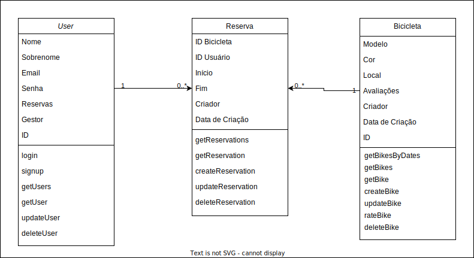
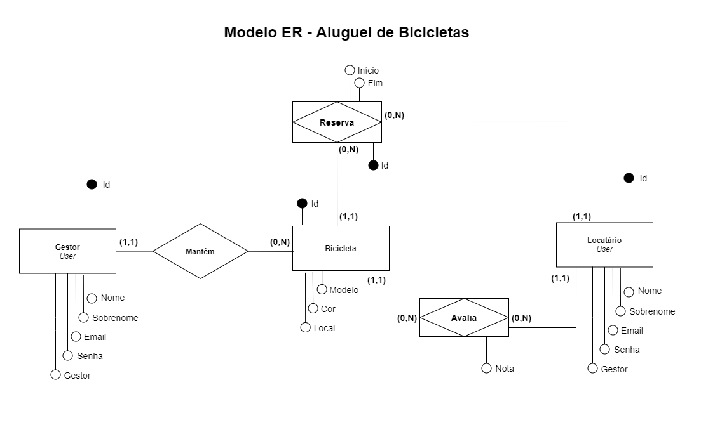
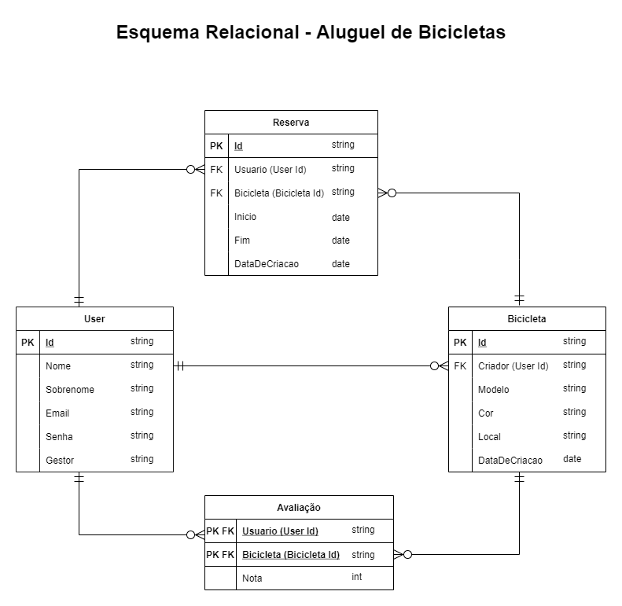

# Arquitetura da Solução

Pré-requisitos: <a href="3-Projeto de Interface.md"> Projeto de Interface</a>

Nesta seção apresentamos a definição da estrutura do software em termos dos componentes que fazem parte da solução e do ambiente de hospedagem da aplicação.

## Diagrama de Classes

Diagrama que ilustra as classes que compõem o sistema, bem como seus atributos, métodos e relações entre objetos.

    

## Modelo ER

Diagrama que descreve o conjunto de entidades do sistema, seus atributos e relacionamentos.

    

## Esquema Relacional

Esquema que representa o relacionamento entre as tabelas que armazenam os dados necessários ao sistema.

    

## Modelo Físico

O arquivo banco.sql contendo os scripts de criação das tabelas do banco de dados foi disponibilizado pasta src\bd.

## Tecnologias Utilizadas

#### [Typescript](https://pt.wikipedia.org/wiki/TypeScript) 
TypeScript é uma linguagem de programação de código aberto desenvolvida pela Microsoft. É um superconjunto sintático estrito de JavaScript e adiciona tipagem estática opcional à linguagem.

#### [Styled Components](https://medium.com/nossa-coletividad/styled-components-padr%C3%B5es-em-produ%C3%A7%C3%A3o-4958e91d4d92)
Styled-components é uma biblioteca para React e React Native que permite que você use estilos ao nível de componente na sua aplicação. Eles são escritos em uma mistura de JavaScript com CSS.

#### [Eslint](https://oieduardorabelo.medium.com/evitando-erros-com-eslint-91b5a4bb9471)
ESLint é uma ferramenta de lint plugável para JavaScript e JSX.
Linting é o processo de aplicar regras a uma base de código e destacar padrões ou códigos problemáticos que não aderem a determinadas diretrizes de estilo.

O linting moderno de JavaScript também inclui a correção automática de problemas. E uma das ferramentas que permitem esse tipo de verificação é o ESLint, um projeto de código aberto em JavaScript que permite que os desenvolvedores descubram problemas com seu código sem a necessidade de executá-lo.

#### [Node.js](https://tecnoblog.net/410498/o-que-e-node-js-guia-para-iniciantes/)
Node.js é um ambiente de execução JavaScript que permite executar aplicações desenvolvidas com a linguagem de forma autônoma, sem depender de um navegador. Com ele, é possível criar praticamente qualquer tipo de aplicações web, desde servidores para sites estáticos e dinâmicos, até APIs e sistemas baseados em microserviços.

#### [React Native](https://reactnative.dev/)
React Native é uma biblioteca Javascript criada pelo Facebook. É usada para desenvolver aplicativos para os sistemas Android e iOS de forma nativa.

#### [Jest](https://www.devmedia.com.br/teste-unitario-com-jest/41234)
Jest é um framework de teste unitário de código aberto em JavaScript criado pelo Facebook a partir do framework Jasmine. Jest é uma das ferramentas de teste unitário mais difundidas dentro da comunidade de JavaScript.

#### [Cypress](https://medium.com/@faelbercam/um-overview-sobre-cypress-io-framework-de-automa%C3%A7%C3%A3o-de-testes-end-to-end-dc438b9ee7a1)
O Cypress.io é um framework de testes automatizados end-to-end usando JavaScript! O Cypress também opera na camada de rede, lendo e alterando o tráfego da web em tempo real. Isso permite que o Cypress não apenas modifique tudo que entra e sai do navegador, mas também altere o código que pode interferir em sua capacidade de automatizar o navegador. 

O Cypress por fim, controla todo o processo de automação de cima para baixo, o que o coloca em uma posição única de poder entender tudo o que acontece dentro e fora do navegador. Isso significa que ele é capaz de fornecer resultados mais consistentes do que qualquer outra ferramenta de testes.

#### [Vscode](https://pt.wikipedia.org/wiki/Visual_Studio_Code)
O Visual Studio Code é um editor de código-fonte desenvolvido pela Microsoft para Windows, Linux e macOS. Ele inclui suporte para depuração, controle de versionamento Git incorporado, realce de sintaxe, complementação inteligente de código, snippets e refatoração de código. Ele é customizável, permitindo que os usuários possam mudar o tema do editor, teclas de atalho e preferências. Ele é um software livre e de código aberto, apesar do download oficial estar sob uma licença proprietária.

## Hospedagem

O aplicativo Nossa Bike será hospedado na plataforma Heroku. A escolha dessa plataforma se justifica pela possibilidade de realizar o deploy de aplicações construídas com React Native de maneira gratuita, simplificada e rápida.

<!-- > **Links Úteis**:
>
> - [Website com GitHub Pages](https://pages.github.com/)
> - [Programação colaborativa com Repl.it](https://repl.it/)
> - [Getting Started with Heroku](https://devcenter.heroku.com/start)
> - [Publicando Seu Site No Heroku](http://pythonclub.com.br/publicando-seu-hello-world-no-heroku.html) -->

## Qualidade de Software

Conceituar qualidade de fato é uma tarefa complexa, mas ela pode ser vista como um método gerencial que através de procedimentos disseminados por toda a organização, busca garantir um produto final que satisfaça às expectativas dos stakeholders.

No contexto de desenvolvimento de software, qualidade pode ser entendida como um conjunto de características a serem satisfeitas, de modo que o produto de software atenda às necessidades de seus usuários. Entretanto, tal nível de satisfação nem sempre é alcançado de forma espontânea, devendo ser continuamente construído. Assim, a qualidade do produto depende fortemente do seu respectivo processo de desenvolvimento.

A norma internacional ISO/IEC 25010, que é uma atualização da ISO/IEC 9126, define oito características e 30 subcaracterísticas de qualidade para produtos de software.
Com base nessas características e nas respectivas sub-características, identifique as sub-características que sua equipe utilizará como base para nortear o desenvolvimento do projeto de software considerando-se alguns aspectos simples de qualidade. Justifique as subcaracterísticas escolhidas pelo time e elenque as métricas que permitirão a equipe avaliar os objetos de interesse.

> **Links Úteis**:
>
> - [ISO/IEC 25010:2011 - Systems and software engineering — Systems and software Quality Requirements and Evaluation (SQuaRE) — System and software quality models](https://www.iso.org/standard/35733.html/)
> - [Análise sobre a ISO 9126 – NBR 13596](https://www.tiespecialistas.com.br/analise-sobre-iso-9126-nbr-13596/)
> - [Qualidade de Software - Engenharia de Software 29](https://www.devmedia.com.br/qualidade-de-software-engenharia-de-software-29/18209/)
