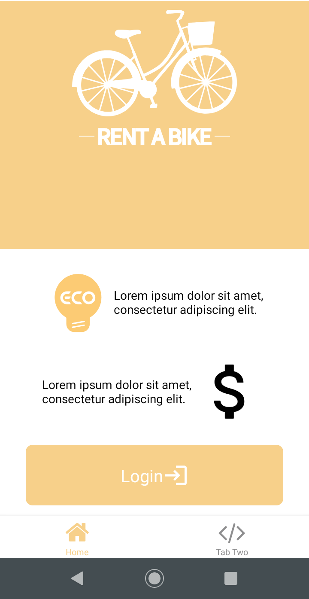
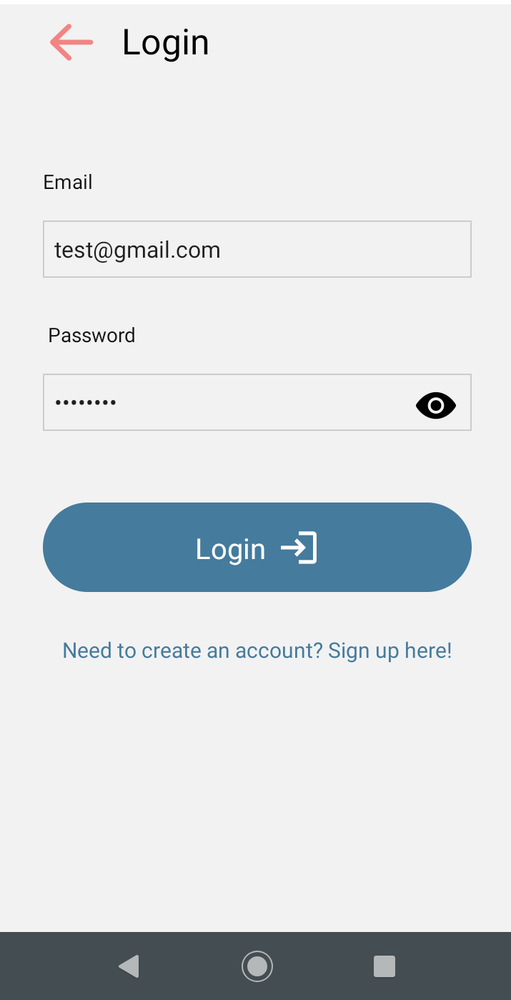
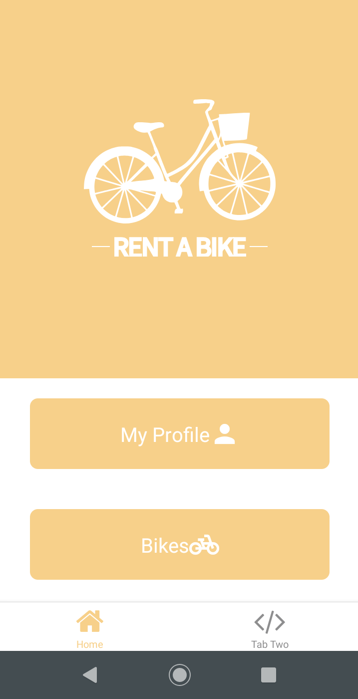
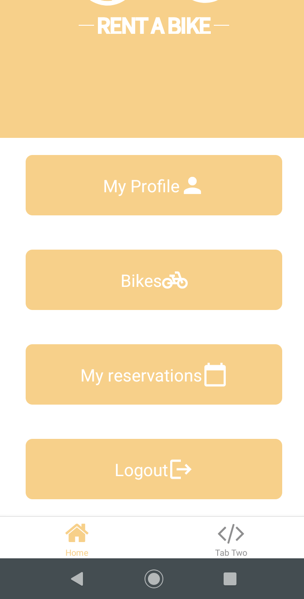
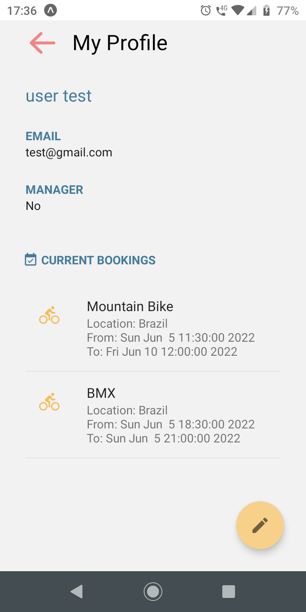

# Programação de Funcionalidades

Pré-requisitos: <a href="2-Especificação do Projeto.md"> Especificação do Projeto</a>, <a href="3-Projeto de Interface.md"> Projeto de Interface</a>, <a href="4-Metodologia.md"> Metodologia</a>, <a href="3-Projeto de Interface.md"> Projeto de Interface</a>, <a href="5-Arquitetura da Solução.md"> Arquitetura da Solução</a>

Nesta seção apresentamos as telas desenvolvidas para cada uma das funcionalidades do sistema.

## Home

A página apresenta informações sobre a aplicação e um botão de Login.

 

### Instrução de Acesso
1. Abra um navegador de Internet e informe a seguinte URL: http://localhost:19002
2. Execute a aplicação escaneando o QR Code com o aplicativo Expo Go instalado no seu smartphone ou utilize um emulador do sistema operacional de sua preferência

  

## Login 

A página Login apresenta um formulário com dois campos: email e senha, que permite que o usuário inicie uma sessão no sistema.  
 

### Requisitos Atendidos
- RF002 e RF003

### Instrução de Acesso
1. Na página Home clique no botão "Login"

  

## Menu

Exibe o menu de navegação através do qual é possível acessar as diversas funcionalidades da aplicação.
 

### Instrução de Acesso
1. A página é exibida após realizar login.

  

## Meu Perfil

A página Meu Perfil apresenta dados do usuário logado como Nome e Email e informa se o perfil é do tipo 'Manager', além disso, exibe um botão que redireciona para a tela Editar Perfil.
 

### Requisitos Atendidos
- RF-007 e RF-014

### Instrução de Acesso
1. Realize Login no sistema
2. Clique no Menu "My Profile"

### Sobre a Implementação
Responsável: Amanda Salles Monteiro  
Continuidade: Implementação da lista de reservas do usuário que deve ser exibida nesta tela

  