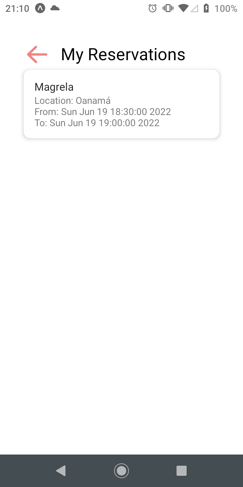
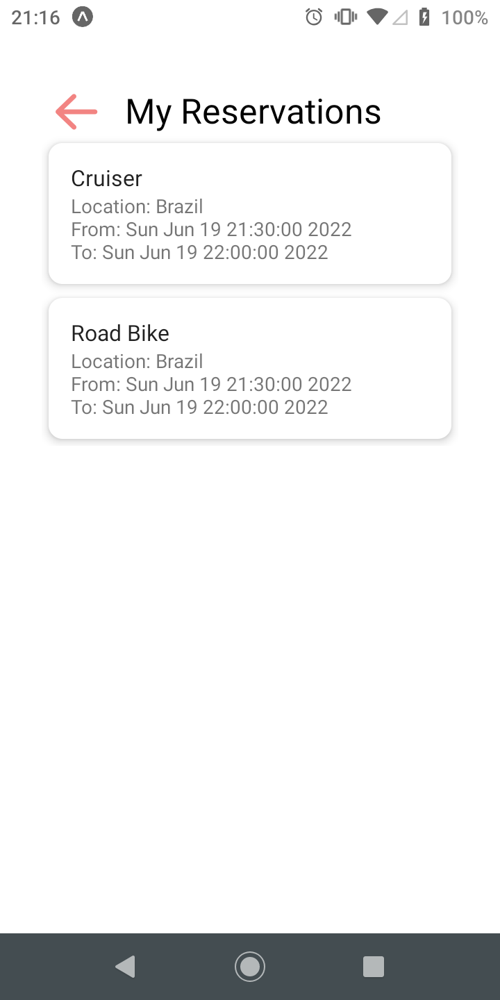
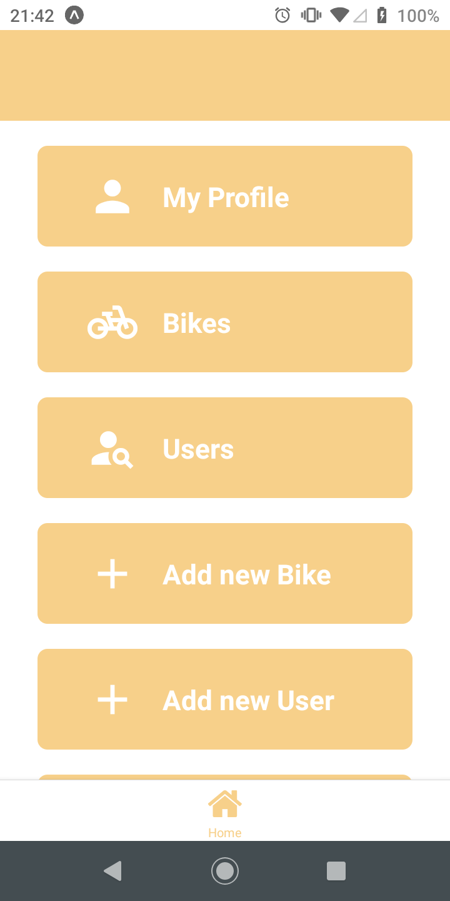
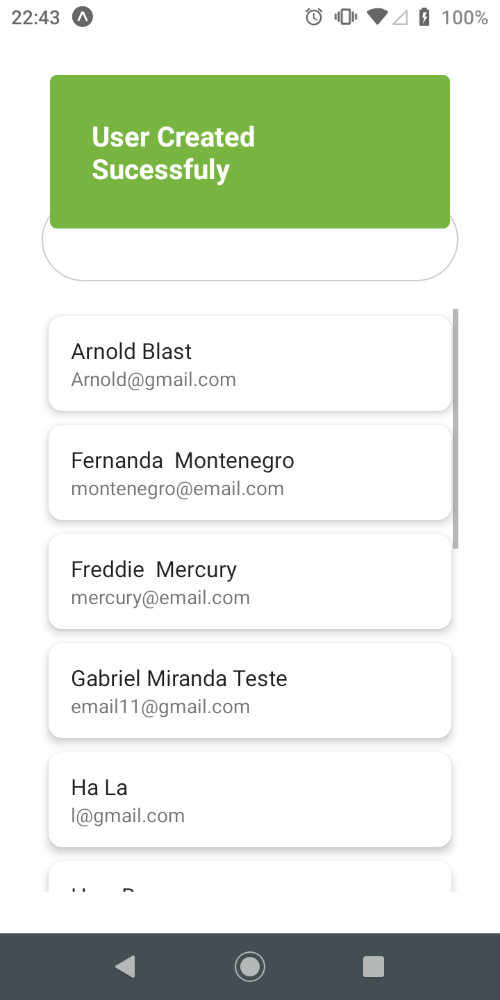

# Registro de Testes de Software

Pré-requisitos: <a href="3-Projeto de Interface.md"> Projeto de Interface</a>, <a href="8-Plano de Testes de Software.md"> Plano de Testes de Software</a>

Relatório com as evidências dos testes de software realizados na aplicação pela equipe, baseado em um plano de testes pré-definido.

###  CT-001 - Sistema deve permitir que usuários se cadastrem 

 

<!--  -->

<strong>Resultado:</strong> Critérios de êxito atendidos

 

###  CT-002 - Sistema deve permitir que usuários efetuem login 
 

<strong>Resultado:</strong> Critérios de êxito atendidos

 

###  CT-003 - Sistema deve permitir que usuários efetuem logout 
 

<strong>Resultado:</strong> Critérios de êxito atendidos

 

###  CT-004 - Sistema deve permitir que usuários realizem buscas 
 

<strong>Resultado:</strong> Critérios de êxito atendidos

 

###  CT-005 - Sistema deve permitir que o usuário reserve uma bike 
- Bicicleta reservada continua na lista das disponíveis permitindo que seja reservada mais de uma vez no mesmo período

<strong>Resultado:</strong> Critérios de êxito parcialmente atendidos

 

###  CT-006 - Sistema deve permitir que o usuário cancele uma reserva 
 

<strong>Resultado:</strong> Critérios de êxito atendidos

 

###  CT-007 - Sistema deve permitir que o usuário visualize suas reservas 
 

<strong>Resultado:</strong> Critérios de êxito atendidos

 

###  CT-008 - Sistema deve permitir que usuários avaliem bicicletas 
 

<strong>Resultado:</strong> Critérios de êxito atendidos

 

###  CT-009 - Sistema deve permitir que gestores criem, alterem e deletem uma bicicleta 
 

Criar

 

Alterar

 

Deletar

<strong>Resultado:</strong> Critérios de êxito atendidos

 

###  CT-010 - Sistema deve permitir que gestores criem, edite e delete um usuário 
 

Criar

 

Alterar

 

Deletar

<strong>Resultado:</strong> Critérios de êxito atendidos

 

###  CT-011 - Sistema deve permitir que gestores vejam lista de usuários 
 

<strong>Resultado:</strong> Critérios de êxito atendidos

 

###  CT-012 - Sistema deve permitir que gestores vejam lista de bicicletas 
 

<strong>Resultado:</strong> Critérios de êxito atendidos

 

## Avaliação

Obtivemos sucesso em 91,7% dos testes realizados, o bug encontrado e apresentado neste relatório (CT-005) será corrigido na próxima versão.